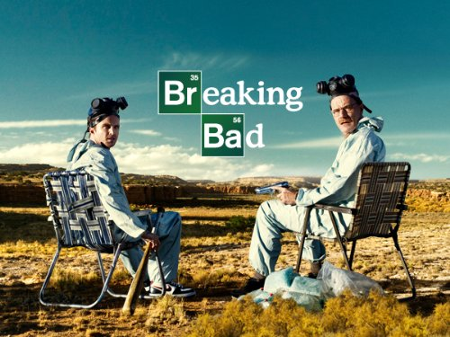
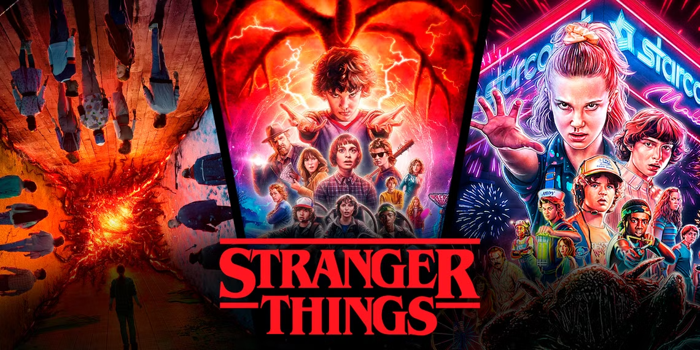
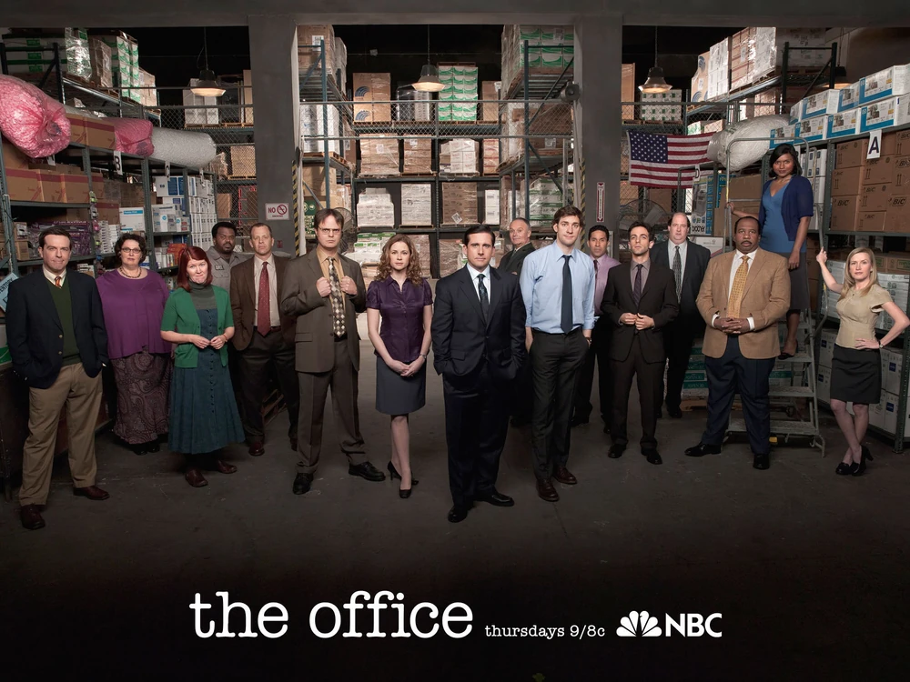

# app-dev
My first repository
<delete this>

# My Favorite Series 
 ## Top 3 Shows 
 1. *Breaking Bad*
 >
_Genre: Crime, Drama_

 >A high school chemistry teacher turned methamphetamine producer. "Breaking Bad" is a critically acclaimed American television drama series that follows the transformation of Walter White, a chemistry teacher, after he's diagnosed with terminal cancer. He turns to producing and selling crystal meth with his former student Jesse Pinkman to secure his family's future. The series, created by Vince Gilligan, explores themes of power, greed, and the consequences of actions.

 2. *Stranger Things*
 >
_Ganre: Sci-Fi, Horor_

 >A group of kids uncover secret experiments and fight supernatural forces.  "Stranger Things" is a science fiction horror series set in the 1980s in the fictional town of Hawkins, Indiana. The show follows a group of young friends as they encounter supernatural forces and government secrets, uncovering a mystery involving a missing boy and a mysterious girl named Eleven with telekinetic abilities. The series explores themes of friendship, family, and the dangers of unchecked power.

 3. *The Office (US)*
 >
_Genre: Comedy_

> A hilarious mockumentary about office life. "The Office" is an American mockumentary sitcom that follows the daily lives of the office staff at Dunder Mifflin, a fictional paper company in Scranton, Pennsylvania. Created by Greg Daniels as an adaptation of the British series of the same name, the show explores workplace dynamics, humor, and relationships through the lens of a documentary crew following the employees. 
 
 ### Why I Love These Shows 
> “Television is an ever-changing form of art.”
 — Unknown 
 - Engaging storylines 
 - Memerable characters 
 - Great writing
 - Fun and confusing

_*LAVOUGE*_

 
